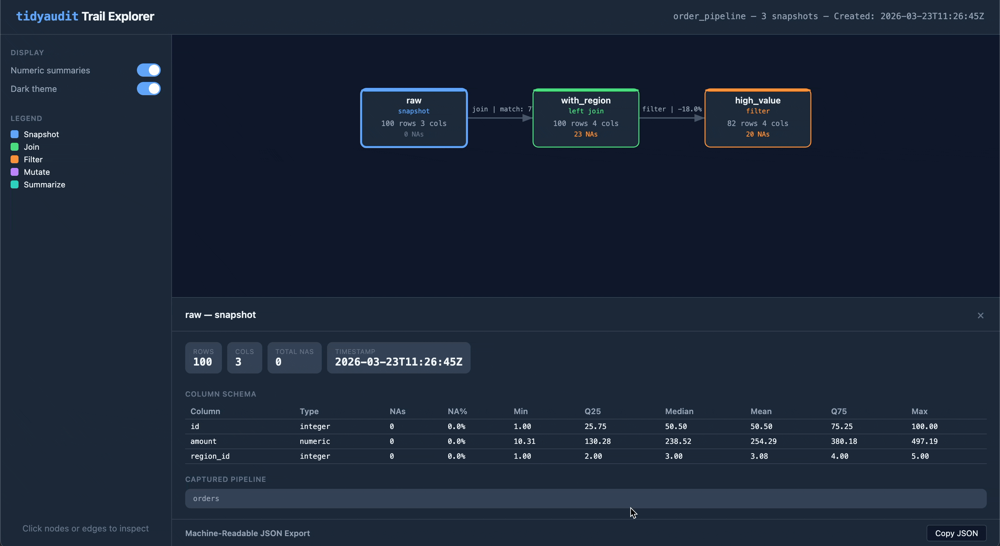

# tidyaudit

## Pipeline audit trails and data diagnostics for tidyverse workflows

**Audit trails** track what happens at every step of a dplyr pipeline by
recording metadata-only snapshots — row counts, column changes, NA
totals, numeric shifts, and custom functions. You build a trail by
dropping **taps** into your pipe: transparent pass-throughs that record
a snapshot and let the data flow on. Operation-aware taps like
[`left_join_tap()`](https://fpcordeiro.github.io/tidyaudit/reference/join_tap.md)
and
[`filter_tap()`](https://fpcordeiro.github.io/tidyaudit/reference/filter_tap.md)
go further, capturing match rates, drop counts, and stat impact. The
result is a structured trail you can print, diff, export as HTML, or
serialize to JSON. You can learn more in
[`vignette("tidyaudit")`](https://fpcordeiro.github.io/tidyaudit/articles/tidyaudit.md).

tidyaudit also includes a **diagnostic toolkit** for interactive data
exploration — join validation, key checks, table comparison, and more —
described in
[`vignette("diagnostics")`](https://fpcordeiro.github.io/tidyaudit/articles/diagnostics.md).

## Quick start

``` r
library(tidyaudit)
library(dplyr)
set.seed(123)

orders  <- data.frame(id = 1:100, amount = runif(100, 10, 500), region_id = sample(1:5, 100, TRUE))
regions <- data.frame(region_id = 1:4, name = c("North", "South", "East", "West"))

trail <- audit_trail("order_pipeline")

result <- orders |>
  audit_tap(trail, "raw") |>
  left_join_tap(regions, by = "region_id", .trail = trail, .label = "with_region") |>
  filter_tap(amount > 100, .trail = trail, .label = "high_value", .stat = amount)
#> i filter_tap: amount > 100
#> Dropped 18 of 100 rows (18.0%)
#> Stat amount: dropped 1,062.191 of 25,429.39

print(trail)
#> -- Audit Trail: "order_pipeline" -----------------------------------------------
#> Created: 2026-02-21 14:36:35
#> Snapshots: 3
#>
#>   #  Label        Rows  Cols  NAs  Type
#>   -  -----------  ----  ----  ---  ------------------------------------
#>   1  raw           100     3    0  tap
#>   2  with_region   100     4   23  left_join (many-to-one, 77% matched)
#>   3  high_value     82     4   20  filter (dropped 18 rows, 18%)
#>
#> Changes:
#>   raw -> with_region: = rows, +1 cols, +23 NAs
#>   with_region -> high_value: -18 rows, = cols, -3 NAs

audit_diff(trail, "raw", "high_value")
#> -- Audit Diff: "raw" -> "high_value" --
#>
#>   Metric  Before  After  Delta
#>   ------  ------  -----  -----
#>   Rows       100     82    -18
#>   Cols         3      4     +1
#>   NAs          0     20    +20
#>
#> Columns added: name
#>
#> Numeric shifts (common columns):
#>     Column     Mean before  Mean after   Shift
#>     ---------  -----------  ----------  ------
#>     id               50.50       49.66   -0.84
#>     amount          254.29      297.16  +42.87
#>     region_id         3.08        3.05   -0.03
```

Three taps. Three snapshots. A complete record of what the pipeline did
to your data — and what it cost.

### Export as HTML

Share a trail as a self-contained HTML file — one file you can email,
attach to a report, or drop into a compliance folder:

``` r
audit_export(trail, "order_pipeline.html")
```

The output is an interactive flow diagram with clickable nodes and
edges, light/dark theme toggle, and embedded JSON export. No server or
internet required.



audit_export demo

## Features

### Audit trail system

Build a structured timeline of your pipeline’s behavior. Drop taps into
any dplyr pipe and get a traceable, diffable, exportable record of every
step.

- [`audit_trail()`](https://fpcordeiro.github.io/tidyaudit/reference/audit_trail.md)
  /
  [`audit_tap()`](https://fpcordeiro.github.io/tidyaudit/reference/audit_tap.md)
  — create a trail and record snapshots inside pipes
- [`left_join_tap()`](https://fpcordeiro.github.io/tidyaudit/reference/join_tap.md),
  [`filter_tap()`](https://fpcordeiro.github.io/tidyaudit/reference/filter_tap.md),
  and friends — **operation-aware taps** that capture match rates, drop
  counts, stat impact, and relationship types
- [`tab_tap()`](https://fpcordeiro.github.io/tidyaudit/reference/tab_tap.md)
  — track frequency distributions across pipeline steps
- [`audit_diff()`](https://fpcordeiro.github.io/tidyaudit/reference/audit_diff.md)
  — before/after comparison of any two snapshots
- [`audit_report()`](https://fpcordeiro.github.io/tidyaudit/reference/audit_report.md)
  — full pipeline report in one call
- [`audit_export()`](https://fpcordeiro.github.io/tidyaudit/reference/audit_export.md)
  — self-contained HTML visualization
- [`write_trail()`](https://fpcordeiro.github.io/tidyaudit/reference/write_trail.md)
  /
  [`read_trail()`](https://fpcordeiro.github.io/tidyaudit/reference/read_trail.md)
  — serialize to RDS or JSON for CI pipelines and dashboards
- Snapshot controls (`.numeric_summary`, `.cols_include`,
  `.cols_exclude`) — fine-tune what each tap captures

### Diagnostic toolkit

Standalone functions for interactive data exploration — the questions
you ask in the console before, during, and after building a pipeline.

- [`validate_join()`](https://fpcordeiro.github.io/tidyaudit/reference/validate_join.md)
  — analyze a join before performing it (match rates, duplicates,
  unmatched keys)
- [`validate_primary_keys()`](https://fpcordeiro.github.io/tidyaudit/reference/validate_primary_keys.md)
  /
  [`validate_var_relationship()`](https://fpcordeiro.github.io/tidyaudit/reference/validate_var_relationship.md)
  — key and relationship validation
- [`compare_tables()`](https://fpcordeiro.github.io/tidyaudit/reference/compare_tables.md)
  — column, row, numeric, and categorical comparison between two data
  frames
- [`filter_keep()`](https://fpcordeiro.github.io/tidyaudit/reference/filter_keep.md)
  /
  [`filter_drop()`](https://fpcordeiro.github.io/tidyaudit/reference/filter_drop.md)
  — filter with diagnostic output and configurable warning thresholds
- [`diagnose_nas()`](https://fpcordeiro.github.io/tidyaudit/reference/diagnose_nas.md)
  /
  [`summarize_column()`](https://fpcordeiro.github.io/tidyaudit/reference/summarize_column.md)
  /
  [`get_summary_table()`](https://fpcordeiro.github.io/tidyaudit/reference/get_summary_table.md)
  — data quality diagnostics
- [`diagnose_strings()`](https://fpcordeiro.github.io/tidyaudit/reference/diagnose_strings.md)
  /
  [`audit_transform()`](https://fpcordeiro.github.io/tidyaudit/reference/audit_transform.md)
  — string quality auditing and type-aware transformation diagnostics
- [`tab()`](https://fpcordeiro.github.io/tidyaudit/reference/tab.md) —
  frequency tables and crosstabulations with sorting, cutoffs, and
  weighting

## Installation

``` r
# Install from CRAN
install.packages("tidyaudit")

# Install development version
pak::pak("fpcordeiro/tidyaudit")
```

## Learn more

- [Audit trail
  walkthrough](https://fpcordeiro.github.io/tidyaudit/articles/tidyaudit.html)
  — build your first trail, use operation-aware taps, export and share
  results
- [Diagnostic functions
  guide](https://fpcordeiro.github.io/tidyaudit/articles/diagnostics.html)
  — validate joins, compare tables, diagnose data quality, and more

## Relationship to dtaudit

tidyaudit is the tidyverse-native counterpart to
[dtaudit](https://github.com/fpcordeiro/dtaudit), a data.table-based
package on CRAN. Same design vocabulary, independent implementations —
choose the one that matches your stack.

## License

LGPL (\>= 3)
